# Nullifier — Private DeFi Intercept

**Nullifier** is an ultra-minimalist, anonymous DeFi client explicitly built for the **Monad Testnet**. 

Leveraging the [@unlink-xyz](https://unlink.xyz/) SDK, Nullifier effectively severs the on-chain link between a user's original funded wallet and their destination DeFi interactions. It achieves this by routing funds through an obfuscated Zero-Knowledge (ZK) privacy pool and generating ephemeral "Burner" accounts to execute transactions in complete anonymity.

---

## 🏗️ Architecture & Interaction Schema

The core innovation relies on the `Burner Account` pattern, heavily utilizing Unlink's stateless privacy pool.
Instead of directly interacting with DEXs, a user shields their funds inside the Unlink pool. The front-end client derives an entirely new burner wallet in-memory, to which the pool dispenses the funds. The burner executes the transaction on the target smart contract, sweeping the output back to the privacy pool before self-destructing.

```mermaid
sequenceDiagram
    participant User as Main Wallet (Public)
    participant Pool as Unlink ZK Pool
    participant Burner as Burner EOA (In-Memory)
    participant DEX as Uniswap V3 (Monad)

    %% 1. Shielding Assets
    rect rgb(30, 30, 30)
    Note over User, Pool: Phase 1: Shielding
    User->>Pool: 1. Deposit Tokens (USDTm, USDCm, ULNKm)
    User->>Pool: 2. Send Gas (MON for Burner fees)
    Pool-->>Pool: Obfuscate On-Chain Link via ZK Proofs
    end

    %% 2. Execution
    rect rgb(20, 20, 40)
    Note over Pool, Burner: Phase 2: Ephemeral Execution
    Burner->>Pool: 3. Withdraw funds anonymously
    Pool-->>Burner: Sends clean tokens to Burner address
    
    Burner->>DEX: 4. approve(MAX_UINT256) (Only if needed)
    Burner->>DEX: 5. swapAforB / swapBforA
    DEX-->>Burner: Returns Swapped Tokens
    end

    %% 3. Sweeping
    rect rgb(40, 20, 20)
    Note over Burner, Pool: Phase 3: Sweeping
    Burner->>Pool: 6. Sweep remaining balance to Pool
    Burner->>Burner: 7. Erase Private Key from Memory
    end
    
    %% 4. Unshielding
    rect rgb(30, 30, 30)
    Note over Pool, User: Phase 4: Unshielding (Optional)
    User->>Pool: 8. Withdraw to Public Wallet
    User->>Pool: Or Withdraw to ANY external unlinked address
    end
```



---

## 🛠 Features

1. **Anonymous Funding (Shielding):** Route USDTm, USDCm, ULNKm, and native MON into the Unlink Privacy Pool.
2. **In-Memory Burners:** Deterministically generate index-based burner Master Nodes derived strictly in-memory from a session mnemonic. Never touches disk storage.
3. **Private Swaps (AMMs):** Execute simple swaps on standard router contracts (USDTm <-> USDCm) via the burner, leaving zero trace mapping back to the funder.
4. **Automated Sweep Logic:** One-click functionality to return all burner assets back into the unlinked pool, preserving anonymity post-interaction.
5. **Direct Pool Unshielding:** Withdraw clean funds from the privacy pool to any newly generated destination address.

## 💻 Tech Stack
- **Framework:** Next.js 14 (App Router)
- **Styling:** Tailwind CSS (Strict Monochromatic Tooling UI `[#0a0a0a, #ffffff, #e0e0e0]`)
- **Web3 Interface:** Wagmi + Viem
- **Privacy Engine:** `@unlink-xyz/react`, `@unlink-xyz/core`
- **Network:** Monad Testnet (`chain id: 20143`)

## ⚡ Getting Started

1. **Install Dependencies:**
```bash
npm install
```

2. **Run Local Server:**
```bash
npm run dev
```

3. **Navigate:** Open `http://localhost:3000` to access the Dashboard.

## ⚠️ Known Monad RPC Considerations
Due to rapid block propagation on the Monad Testnet, aggressive RPC calls (e.g., executing a swap directly following an ERC-20 `approve`) can sometimes trigger `ERC20InsufficientAllowance` estimation failures across discordant RPC nodes. Nullifier bypasses this latency by utilizing an `approve(MAX_UINT256)` caching model combined with orchestrated state propagation delays.
